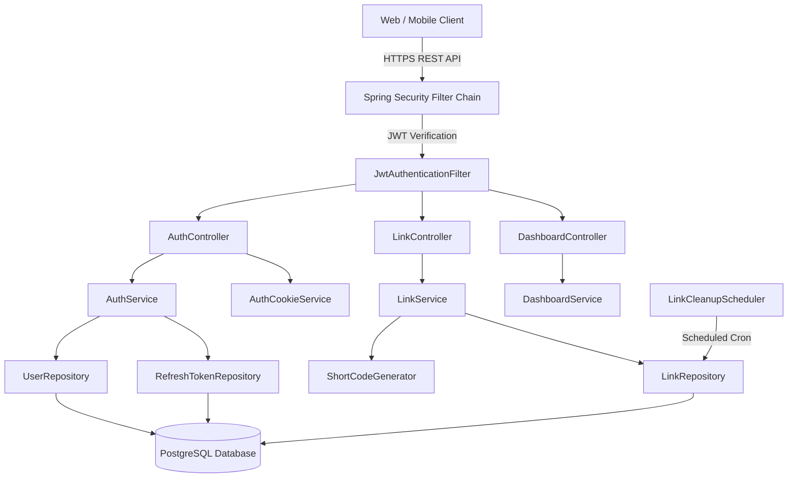
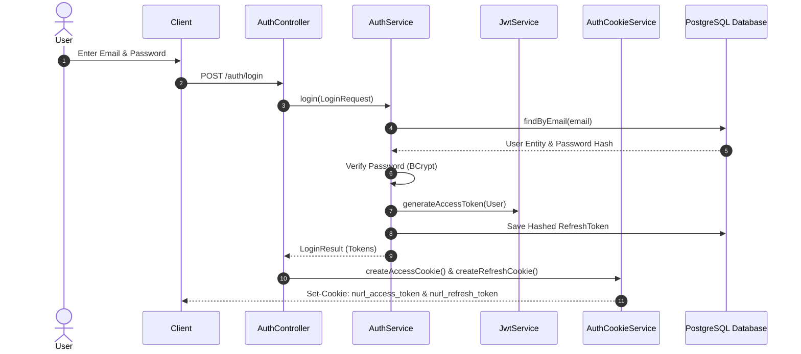
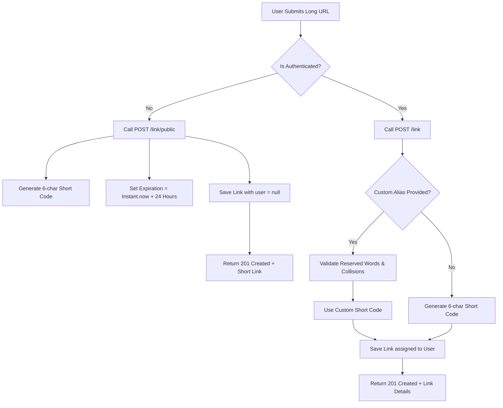
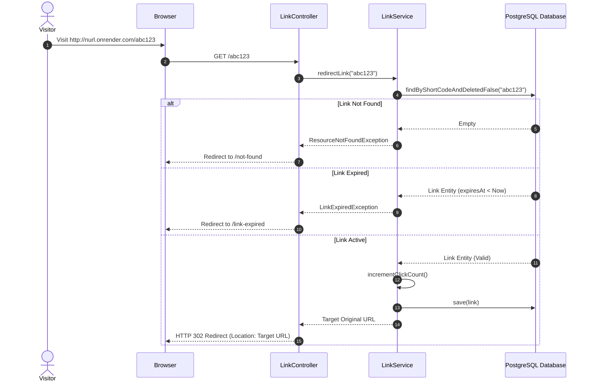

# 🔗 NURL Backend — High-Performance URL Shortener & Analytics Engine

[](https://spring.io/projects/spring-boot)
[](https://www.oracle.com/java/)
[](https://www.postgresql.org/)
[](https://flywaydb.org/)
[](https://jwt.io/)
[](https://maven.apache.org/)

**NURL** is an enterprise-grade, high-throughput RESTful backend service built with **Spring Boot 3**, **Spring Security**, and **PostgreSQL**. It provides instant URL shortening, custom alias reservation, real-time analytics, automated link expiration, soft deletion recovery, background retention cleanup, and secure JWT-based HttpOnly cookie authentication designed for modern web applications.

---

## 📋 Table of Contents

- [✨ Core Features](#-core-features)
- [🏗 System Architecture](#-system-architecture)
- [🔄 Application Execution Flows](#-application-execution-flows)
  - [1. User Authentication & Cookie Lifecycle](#1-user-authentication--cookie-lifecycle)
  - [2. Public & Authenticated Link Creation](#2-public--authenticated-link-creation)
  - [3. Short Link Redirection & Click Tracking](#3-short-link-redirection--click-tracking)
  - [4. Soft Delete, Expiration & Smart Restore](#4-soft-delete-expiration--smart-restore)
  - [5. Automated Background Cleanup](#5-automated-background-cleanup)
- [🗄 Database Schema & Migrations](#-database-schema--migrations)
- [📡 API Endpoint Reference](#-api-endpoint-reference)
- [⚙ Environment Configuration](#-environment-configuration)
- [🚀 Local Setup & Deployment Guide](#-local-setup--deployment-guide)
- [🧪 Testing & Verification](#-testing--verification)

---

## ✨ Core Features

- ⚡ **Guest Short URLs**: Unauthenticated users can generate short links with an enforced 24-hour expiration period without account registration.
- 🔐 **Dual-Token HttpOnly Auth**: Access & Refresh token rotation issued via secure, HttpOnly, SameSite-compliant cookies to mitigate XSS and CSRF vectors.
- 🎯 **Custom Short Aliases**: Authenticated users can reserve custom short codes with built-in reserved word collision checking.
- 📊 **Real-time Analytics**: Tracks total visits, link status (Active, Expired, Deleted), and owner-specific metrics.
- 🗑️ **Soft Delete & Expiration Protection**: Links can be soft-deleted to a trash bin. Restoration includes expiration checks to prevent reactivating expired links.
- 🧹 **Automated Retention Cleanup**: Scheduled Spring Cron scheduler (`LinkCleanupScheduler`) automatically purges expired soft-deleted links.
- 🐘 **Versioned Schema Migrations**: Managed PostgreSQL migrations via Flyway (`V1` to `V4`).

---

## 🏗 System Architecture



---

## 🔄 Application Execution Flows

### 1. User Authentication & Cookie Lifecycle



---

### 2. Public & Authenticated Link Creation



---

### 3. Short Link Redirection & Click Tracking



---

### 4. Soft Delete, Expiration & Smart Restore

```mermaid
flowchart LR
    Active[Active Link] -->|DELETE /link/{id}| Deleted[Soft Deleted Link]
    Deleted -->|PATCH /link/{id}/restore| RestoreCheck{Is Expired?}
    RestoreCheck -- Yes --> Reject[Throw BadRequestException: Cannot restore expired link]
    RestoreCheck -- No --> Restored[Restore to Active Status]
    Deleted -->|DELETE /link/{id}/permanent| HardDelete[Permanently Removed from DB]
```

---

### 5. Automated Background Cleanup

1. **Scheduler Trigger**: `LinkCleanupScheduler` executes daily via `@Scheduled(cron = "${app.cleanup.cron}")`.
2. **Retention Verification**: Queries soft-deleted links older than retention period (`retentionDays`).
3. **Purge Action**: Permanently deletes matching link records from PostgreSQL database to optimize disk storage.

---

## 🗄 Database Schema & Migrations

Database schema versioning is managed via **Flyway**:

- **`V1__create_initial_schema.sql`**: Creates `users`, `roles`, and `links` tables with constraints.
- **`V2__add_link_indexes.sql`**: Indexes `short_code` and `user_id` for fast query lookup performance.
- **`V3__create_refresh_tokens.sql`**: Introduces hashed `refresh_tokens` table for session management.
- **`V4__make_user_id_nullable_in_links.sql`**: Drops `NOT NULL` on `links.user_id` to allow guest link generation.

---

## 📡 API Endpoint Reference

### 🔓 Public Endpoints
| Method | Endpoint | Description |
| :--- | :--- | :--- |
| `POST` | `/link/public` | Create a 1-day temporary short link (No auth required) |
| `GET` | `/{shortCode}` | Redirect short code to original target URL |
| `GET` | `/link/qr/{shortCode}` | Generate PNG QR code image for short code |
| `POST` | `/auth/login` | Authenticate user & set HttpOnly cookies |
| `POST` | `/auth/register` | Register new user account |
| `POST` | `/auth/refresh` | Refresh access token using refresh cookie |
| `POST` | `/auth/logout` | Revoke session & clear cookies |

### 🔒 Authenticated Endpoints
| Method | Endpoint | Description |
| :--- | :--- | :--- |
| `POST` | `/link` | Create custom short URL (Auth required) |
| `GET` | `/link/user` | Retrieve active links owned by current user |
| `GET` | `/link/deleted` | Retrieve soft-deleted links owned by current user |
| `GET` | `/link/analytics/{shortCode}` | Get click analytics for specified link |
| `PATCH` | `/link/{id}/restore` | Restore soft-deleted link with optional new expiry |
| `DELETE` | `/link/{id}` | Soft delete link |
| `DELETE` | `/link/{id}/permanent` | Permanently delete link |
| `GET` | `/dashboard` | Retrieve user aggregated dashboard statistics |

---

## ⚙ Environment Configuration

| Variable | Description | Default (Local) | Production (Render) |
| :--- | :--- | :--- | :--- |
| `DB_URL` | PostgreSQL JDBC URL | `jdbc:postgresql://localhost:5432/nurl` | Render PostgreSQL URL |
| `DB_USERNAME` | Database User | `postgres` | `nurl_user` |
| `DB_PASSWORD` | Database Password | `root` | Production Secret |
| `JWT_SECRET` | Base64 HMAC Key | *(Default Test Key)* | Production Secret |
| `FRONTEND_URL` | Allowed CORS Origin | `http://localhost:5173` | `https://nurl-1me1.onrender.com` |
| `AUTH_COOKIE_SAME_SITE` | Cookie SameSite | `Lax` | `None` |
| `AUTH_COOKIE_SECURE` | Cookie Secure Flag | `false` | `true` |
| `CLEANUP_CRON` | Retention Cron | `0 0 2 * * *` | `0 0 2 * * *` |

---

## 🚀 Local Setup & Deployment Guide

### Local Running
```bash
# 1. Clone backend repository
git clone https://github.com/Sahil-Ghorpade/nurl.git
cd nurl

# 2. Run application via Maven
mvn spring-boot:run
```

### Production Deployment (Render)
Ensure the following variables are configured in **Render Dashboard ➔ Backend Service Environment**:
```env
FRONTEND_URL=https://nurl-1me1.onrender.com
APP_BASE_URL=https://nurl.onrender.com
AUTH_COOKIE_SAME_SITE=None
AUTH_COOKIE_SECURE=true
```

---

## 🧪 Testing & Verification

Execute the test suite covering authentication, authorization, link shortening, analytics, and dashboard metrics:

```bash
mvn test
```

```
[INFO] Running io.github.sahilghorpade.nurl.auth.service.AuthServiceTest
[INFO] Tests run: 7, Failures: 0, Errors: 0, Skipped: 0

[INFO] Running io.github.sahilghorpade.nurl.dashboard.service.DashboardServiceTest
[INFO] Tests run: 2, Failures: 0, Errors: 0, Skipped: 0

[INFO] Running io.github.sahilghorpade.nurl.link.service.LinkServiceTest
[INFO] Tests run: 33, Failures: 0, Errors: 0, Skipped: 0

[INFO] Running io.github.sahilghorpade.nurl.NurlApplicationTests
[INFO] Tests run: 1, Failures: 0, Errors: 0, Skipped: 0

[INFO] BUILD SUCCESS
```

---

## 📜 License

Distributed under the **MIT License**.
