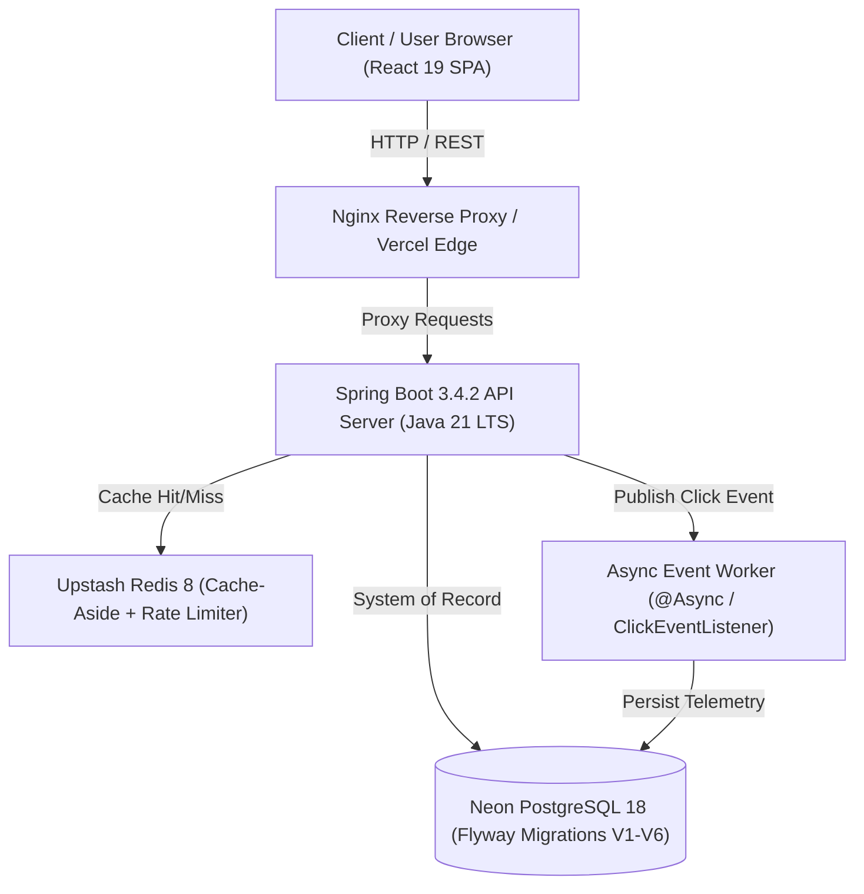

# LinkGuard Platform — Final Production Release Report

## 1. System Architecture Diagram



---

## 2. Repository Directory Structure

```
LinkGuard/
├── backend/
│   ├── pom.xml
│   └── src/
│       ├── main/
│       │   ├── java/com/linkguard/
│       │   │   ├── admin/         (Dashboard, Users, Config, Announcements)
│       │   │   ├── analytics/     (Click Event Logging, Country/Device Aggregations)
│       │   │   ├── auth/          (JWT Auth Provider, User & RefreshToken Entities, BCrypt)
│       │   │   ├── common/        (SecurityConfig, CacheConfig, GlobalExceptionHandler, Base62)
│       │   │   ├── qr/            (QR Studio, PNG & SVG Generator)
│       │   │   ├── redirect/      (High-Speed Redirect Engine, Password Verification)
│       │   │   ├── security/      (Rate Limiter, Blocked IPs, API Keys, Audit Logs)
│       │   │   └── url/           (URL Entity, Custom Aliases, Soft Delete, Expiration)
│       │   └── resources/
│       │       ├── application.yml
│       │       └── db/migration/  (V1__init_schema.sql to V6__add_admin_module_tables.sql)
│       └── test/java/com/linkguard/
├── frontend/
│   ├── package.json
│   ├── vite.config.js
│   ├── vercel.json
│   └── src/
│       ├── components/common/   (Navbar, Footer, Sidebar, StatCard, Modal)
│       ├── context/             (AuthContext.jsx)
│       ├── layouts/             (PublicLayout, UserLayout, AdminLayout)
│       ├── pages/
│       │   ├── admin/           (Dashboard, Users, Urls, Security, Audit, Config)
│       │   ├── public/          (Landing, Features, Pricing, About, Contact, Login, Register)
│       │   └── user/            (Dashboard, Urls, Analytics, QrCodes, Notifications, Settings)
│       └── routes/AppRoutes.jsx
├── docker/
│   ├── Dockerfile.backend
│   ├── Dockerfile.frontend
│   └── nginx.conf
├── docs/
│   ├── 01_PRD.md
│   ├── 02_TRD.md
│   ├── 03_App_Flow.md
│   ├── 04_Tech_Stack.md
│   ├── 05_Backend_Schema_Data_Auth.md
│   ├── 06_Implementation_Plan_Build_Order.md
│   └── 07_Final_Project_Report.md
├── docker-compose.yml
├── render.yaml
└── README.md
```

---

## 3. Database Schema Summary (Flyway Migrations V1–V6)

1. **`users`**: User account credentials, BCrypt password hashes, roles (`USER`, `ADMIN`), and status (`ACTIVE`, `BANNED`).
2. **`refresh_tokens`**: Hashed JWT refresh tokens supporting token rotation and token reuse detection.
3. **`urls`**: Core URL table supporting `short_code`, `custom_alias`, `title`, `description`, `click_count`, `password_hash`, `expires_at`, `deleted_at` (soft delete), and `status`.
4. **`click_events`**: Privacy-compliant click logs storing `ip_hash` (SHA-256), `country`, `city`, `region`, `browser`, `operating_system`, `device_type`, `referrer`, and `user_agent`.
5. **`analytics_summaries`**: Pre-aggregated metrics for total and unique clicks per URL.
6. **`security_events`**: Security threats, rate-limiting violations, and severity logs.
7. **`blocked_ips`**: Administrative IP block rules.
8. **`api_keys`**: User API access keys (`lg_live_*`).
9. **`audit_logs`**: Immutable audit logs of administrative actions.
10. **`qr_codes`**: Custom QR code configurations (`DYNAMIC`, `STATIC`, PNG/SVG formats, foreground/background colors).
11. **`admin_announcements`**: System announcements.
12. **`system_configurations`**: Runtime configuration key-values.

---

## 4. Security & Privacy Summary

- **Stateless JWT Security**: 15-minute access tokens and rotated refresh tokens stored as SHA-256 hashes.
- **Privacy Telemetry**: Raw IP addresses are never saved to the database. All IPs are salted and hashed using SHA-256 (`security.ip-hash-salt`).
- **SSRF Protection**: Redirect target validator automatically rejects internal hosts (`localhost`, `127.0.0.1`, RFC1918 private IPs, AWS metadata service `169.254.169.254`).
- **Rate Limiting**: Distributed Redis fixed window rate limiter throttles traffic per IP.
- **HTTP Security Headers**: Strict CSP directives, `X-Frame-Options: DENY`, `X-Content-Type-Options: nosniff`, and Referrer-Policy.

---

## 5. Performance Summary

- **Sub-millisecond Resolution**: Hot path redirects served directly from Redis (`linkguard:cache:url:<shortCode>`).
- **Fail-Open Resilience**: If Redis experiences network errors or outages, redirect logic gracefully falls back to PostgreSQL without breaking end-user request execution.
- **Non-blocking Analytics**: Click events published asynchronously (`@Async`) via Spring `ApplicationEventPublisher`, preventing analytics persistence from delaying 302 HTTP redirects.
- **Frontend Optimization**: Production bundle built with Vite 6.1, modular code-splitting, Gzip compression, and responsive Tailwind dark mode aesthetics.

---

## 6. Future Enhancements

- Cloudinary automated SDK upload for high-res logo watermarked QR codes.
- GeoIP2 MaxMind database integration for precise city/region IP mapping.
- Custom domain DNS mapping (`CNAME` records) for white-label user links.
